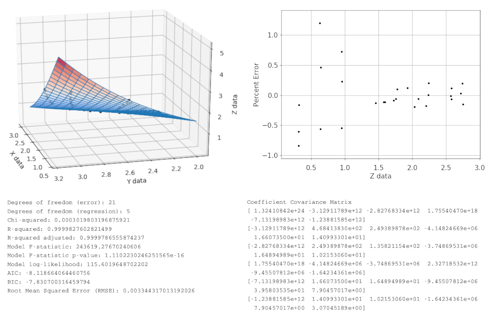

# pyeq3: an equation, curve and surface fitting library

## About

pyeq3 contains a large collection of equations for Python 3 curve
fitting and surface fitting that can output source code in several
computing languages, and run a genetic algorithm for initial
parameter estimation.

pyeq3 comes with cluster, parallel, IPython, GUI, NodeJS,
and web-based graphical examples. Includes orthogonal distance and
relative error regressions. 

 - Homepage: https://github.com/equations-project/pyeq3
 - Documentation: http://pyeq3.readthedocs.io
 - Source code: https://github.com/equations-project/pyeq3
 - Web App: http://findcurves.com/
 - Discussion group: https://groups.google.com/g/findcurves

## Installation

You will need to install python, numpy, scipy and matplotlib to
run this software. On Linux or Mac systems,
you can use this command to get both:
    python -m pip install numpy scipy matplotlib

See the examples directory to get started.
All of the examples should run by typing "python examplename.py"
at a command prompt.

## A brief history of curve and surface fitting
Prior to the invention of electronic calculation, only manual methods
were available, of course - meaning that creating mathematical models
from experimental data was done by hand.  Even Napier's invention of
logarithms did not help much in reducing the tediousness of this task.
Linear regression techniques worked, but how to then compare models?
And so the F-statistic was created for the purpose of model selection,
since graphing models and their confidence intervals was practically
out of the question.  Forward and backward regression techniques used
linear methods, requiring less calculation than nonlinear methods, but
limited the possible mathematical models to linear combinations
of functions.

With the advent of computerized calculations, nonlinear methods which
were impractical in the past could be automated and made practical.
However, the nonlinear fitting methods all required starting points
for their solvers - meaning in practice you had to have a good idea of
the final equation parameters to begin with!

If however a genetic or monte carlo algorithm searched error space for
initial parameters prior to running the nonlinear solvers, this problem
could be strongly mitigated.  This meant that instead of hit-or-miss
forward and backward regression, large numbers of known linear *and*
nonlinear equations could be fitted to an experimental data set, and
then ranked by a fit statistic such as AIC or SSQ errors.

Note that for an initial guesstimate of parameter values, not all data
need be used.  A reduced size data set with min, max, and (hopefully)
evenly spaced additional data points in between are used.  The total
number of data points required is the number of equation parameters
plus a few extra points.

Reducing the data set size used by the code's genetic algorithm greatly
reduces total processing time.  I tested many different methods before
choosing the one in the code, a genetic algorithm named
"Differential Evolution".

## Acknowledgements

 - This project was created by James R. Phillips.
   Almost all the functionality was created by him, as are most of
   the explanatory comments throughout the code.

 - Ross Moffett is webmaster and maintainer of
   http://www.findcurves.com, a clone of James' original web app.
